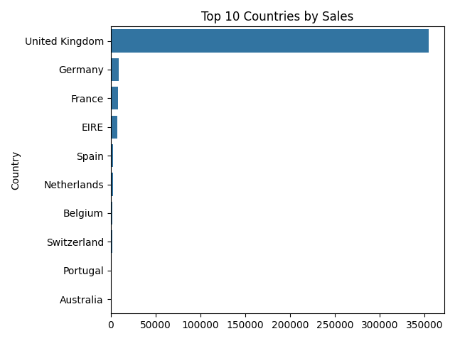
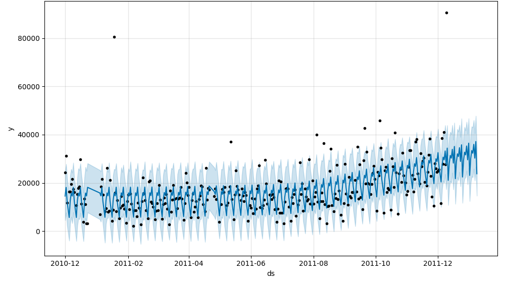

# E-Commerce Sales Analysis

This project performs an exploratory data analysis (EDA) on e-commerce sales data and forecasts future sales using machine learning techniques. The project includes data processing, statistical analysis, customer segmentation, and sales forecasting. Visualizations are generated to provide insights into sales trends, top products, and sales by country.

## Project Structure

- **data.csv**: The e-commerce sales dataset containing transaction data (can be downloaded from [Kaggle](https://www.kaggle.com/datasets/carrie1/ecommerce-data?resource=download)).
- **main.py**: Python script performing the analysis, including EDA, sales forecasting, and RFM analysis.
- **src/**: Contains helper functions used across the analysis.
- **plots/**: Folder containing the generated plots for visualizations.

## Output

### 1. Exploratory Data Analysis (EDA)
The script performs an exploratory analysis of the sales data, focusing on:
- **Monthly Sales**: Displays the total quantity sold per month, allowing you to observe sales trends over time.
  - Example output (Monthly Sales):
    ```text
    Monthly Sales:
    Month
    2010-12    312265
    2011-01    349098
    2011-02    265622
    2011-03    348503
    2011-04    292222
    2011-05    373601
    2011-06    363699
    2011-07    369420
    2011-08    398121
    2011-09    544897
    2011-10    593900
    2011-11    669051
    2011-12    287413
    Freq: M, Name: Quantity, dtype: int64
    ```

  **Monthly Sales Plot**:
  

- **Top 5 Products**: Displays the top five products based on the total quantity sold.
  - Example output (Top 5 Products):
    ```text
    Top 5 Products:
    Description                                 Quantity
    PAPER CRAFT , LITTLE BIRDIE                 80995
    MEDIUM CERAMIC TOP STORAGE JAR              77916
    WORLD WAR 2 GLIDERS ASSTD DESIGNS           54415
    JUMBO BAG RED RETROSPOT                     46181
    WHITE HANGING HEART T-LIGHT HOLDER          36725
    ```

  **Top 5 Products Plot**:
  

- **Sales by Country**: Displays the quantity of sales for each country. This provides insights into which countries generate the most sales.
  - Example output (Sales by Country):
    ```text
    Sales by Country:
    Country                     Quantity
    United Kingdom               354321
    Germany                        9040
    France                         8341
    EIRE                           7236
    Spain                          2484
    Netherlands                    2359
    Belgium                        2031
    Switzerland                    1841
    Portugal                       1462
    Australia                      1182
    Norway                         1071
    Italy                           758
    Channel Islands                 748
    Finland                         685
    Cyprus                          614
    Sweden                          451
    Austria                         398
    Denmark                         380
    Poland                          330
    Japan                           321
    Israel                          248
    Unspecified                     244
    Singapore                       222
    Iceland                         182
    USA                             179
    Canada                          151
    Greece                          145
    Malta                           112
    United Arab Emirates             68
    European Community               60
    RSA                              57
    Lebanon                          45
    Lithuania                        35
    Brazil                           32
    Czech Republic                   25
    Bahrain                          17
    Saudi Arabia                      9
    ```

  **Sales by Country Plot**:
  

### 2. Sales Forecasting
The script uses Facebook Prophet to forecast future sales. It takes the historical sales data and predicts sales for the next 30 periods.

- The output will include a plot of the predicted sales over time, showing both the forecast and the uncertainty intervals.

  **Sales Forecast Plot**:
  

### 3. RFM Analysis for Customer Segmentation
RFM (Recency, Frequency, Monetary) analysis is performed to segment customers based on their behavior. The analysis provides customer segments for targeted marketing or further insights.

- Example output (Customer Segments):
    ```text
    Customer Segments:
       CustomerID  Recency  Frequency  Monetary  Segment
    0     12346.0      325          1     74215        2
    1     12347.0        1        182      2458        0
    2     12348.0       74         31      2341        0
    3     12349.0       18         73       631        0
    4     12350.0      309         17       197        0
    ```

### 4. Visualizations
The following plots are generated as part of the analysis:

1. **Top 5 Products Plot**: A bar chart visualizing the top 5 products by sales quantity.
2. **Monthly Sales Plot**: A line graph showing monthly sales over time.
3. **Sales by Country Plot**: A bar chart displaying sales distribution across different countries.
4. **Sales Forecast Plot**: A plot showing the forecasted sales for the upcoming 30 periods.

## Conclusion

This analysis provides a comprehensive view of e-commerce sales trends, top-selling products, and sales distribution across countries. Through forecasting, we predict future sales, helping with inventory and demand planning. The RFM analysis segments customers for targeted marketing and retention. Overall, this project offers valuable insights to inform strategic decision-making and business optimization.
